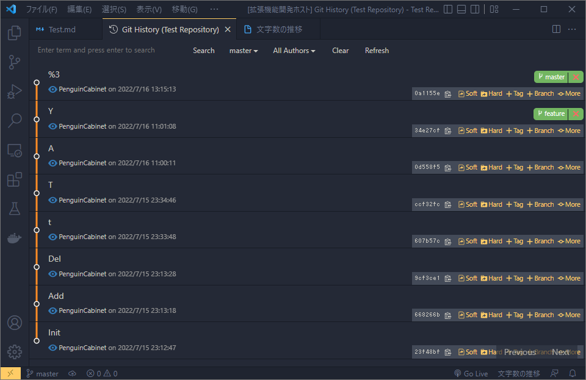
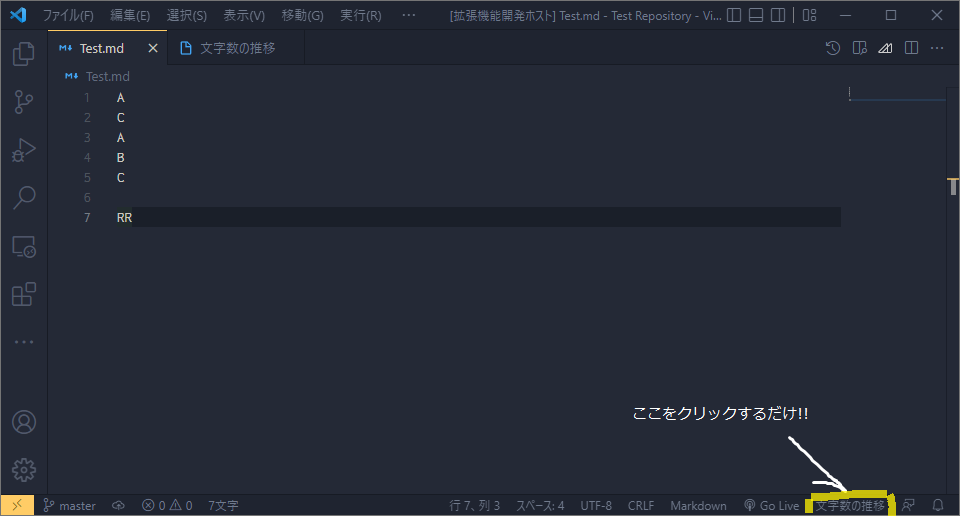

# Writer-Stock
## コミットから執筆量を自動でグラフにできるVS Code拡張機能
ペンギン内閣

---
# 解決したいこと
小説や技術本、ブログ等には文字数の下限が決まっていたりします。
執筆していると自分がどのくらいのペースで書けている気になりますよね?
でも、一々書いた文字数と日付を手入力してグラフを作るのも面倒くさい…
 
**→そうだ、Gitのコミットを利用してグラフを自動生成しよう**

---
# Gitのコミット

---
# 完成品の画像

このようにGitのコミットから自動的に文字数と時刻を取得して、執筆文字数のグラフを取得できます

---
# 使い方も簡単

VS Codeの拡張機能なため、執筆活動からシームレスにグラフを確認できます!!

---
# 使用した技術スタッフ
* JavaScript
* HTML

VS CodeはElectronのため、拡張機能開発にWEBの技術をそのまま流用できる!!(ありがたい)
先ほどのグラフの表示部分も、WebViewでやっているので普通にchart.jsを使っています。

---
# おわり
この拡張機能によって、文字数が可視化されるので執筆者のモチベーションアップにつながると思います
