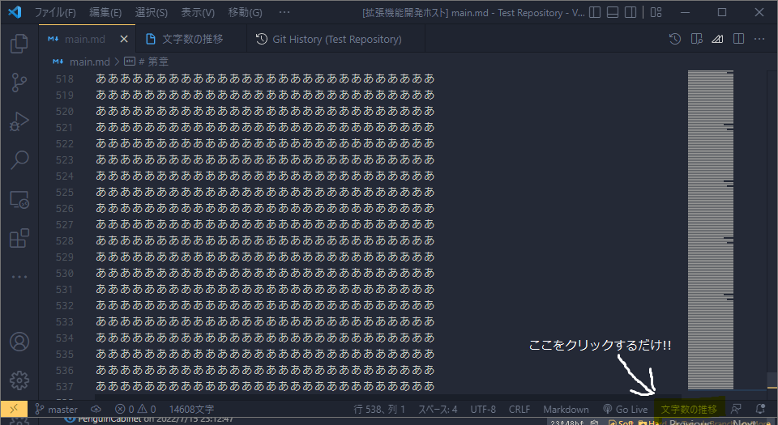

# ✍Writer-Stock
[技育CAMP](https://talent.supporterz.jp/geekcamp/)にて作成しました。  

# ℹ️概要

Gitコミットから執筆文字数のグラフを生成できるVS Code拡張機能です。

# インストール
[VSCode Marketplace]()

# 📒使い方

拡張機能をインストールすると、VS Codeの右下に「文字数の推移」というボタンができると思うので、そこをクリックしてください。   
そうすると作業ディレクトリのGitリポジトリのコミットから、執筆文字数の推移グラフを自動生成します。

