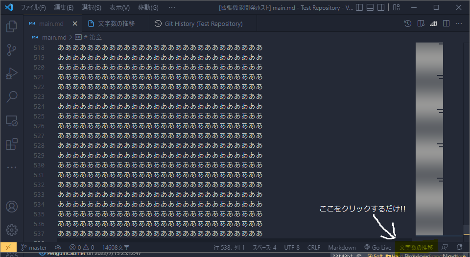

# ✍Writer-Stock

# ℹ️概要


Gitコミットから執筆文字数のグラフを生成できるVS Code拡張機能です。

# ⬇️インストール
[VSCode Marketplace](https://marketplace.visualstudio.com/items?itemName=PenguinCabinet.writer-stock)

## 依存関係
インターネット接続とgitのインストールが必要です

# 📒使い方

拡張機能をインストールすると、VS Codeの右下に「文字数の推移」というボタンができると思うので、そこをクリックしてください。   
そうすると作業ディレクトリのGitリポジトリのコミットから、執筆文字数の推移グラフを自動生成します。

## .wsignore
Gitリポジトリに「.wsignore」を作成すると、「.gitignore」と同じような感覚で、カウントしないファイルを選択できます。   
   
例えば、test.mdを文字数カウントから除外したい場合
```text:.wsignore
test.md
```

またホワイトリスト方式も利用でき、main.mdだけ文字数カウントしたい場合
```text:.wsignore
*
!main.md
```
としてください

